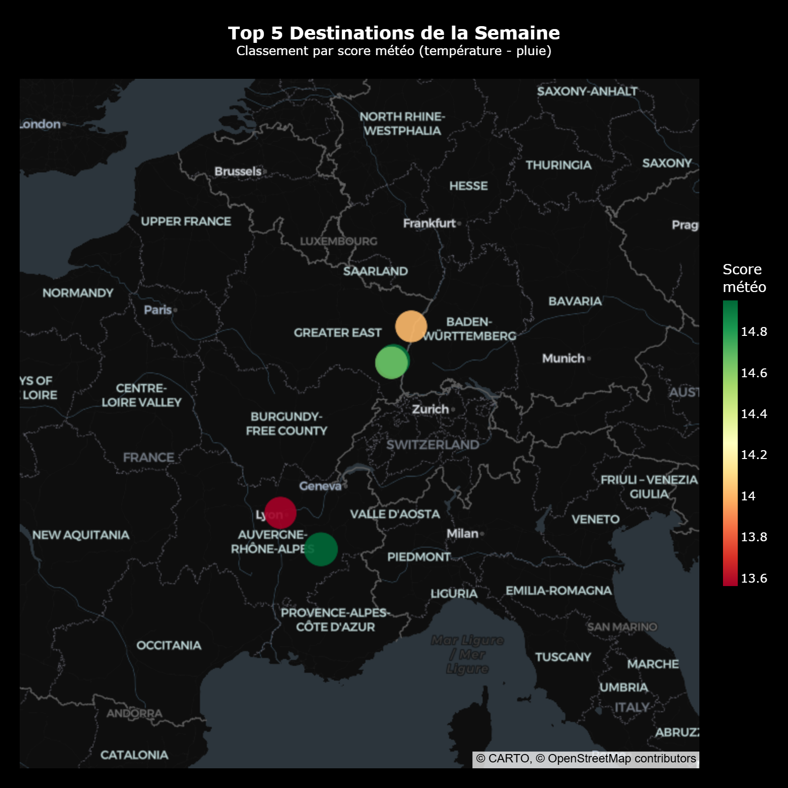
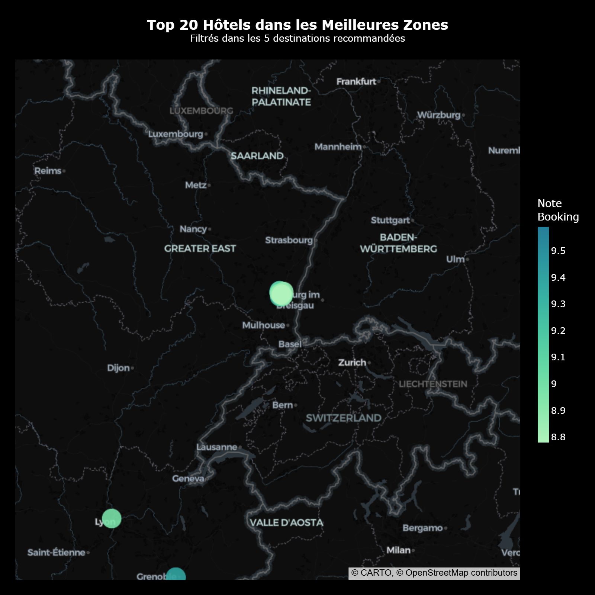

# ✈️ Projet Kayak - Moteur de Recommandation de Voyage


---

## 📋 Vue d'ensemble
Ce projet est un pipeline de **Data Engineering End-to-End** conçu pour recommander les meilleures destinations de voyage en France.

Il répond à la question : *"Où aller et où dormir pour profiter du meilleur climat cette semaine ?"*

Le système automatise 4 étapes clés :
1.  **Collecte (Extract) :** Récupération de données via API (Météo) et Scraping Web (Booking.com).
2.  **Stockage (Data Lake) :** Sauvegarde des données brutes sur **AWS S3**.
3.  **Structuration (Data Warehouse) :** Nettoyage et chargement dans une base SQL sur **AWS RDS PostgreSQL**.
4.  **Visualisation :** Génération de cartes interactives pour l'aide à la décision.

## 🏗️ Architecture Technique

> **Pipeline :** API/Scraping ➔ Python (Pandas) ➔ CSV ➔ **AWS S3** (Data Lake) ➔ ETL ➔ **AWS RDS** (Data Warehouse) ➔ Plotly

## 🚀 Installation et Exécution

### 1. Cloner le projet
```bash
git clone https://github.com/athanormark/KAYAK-_-BLOC-1_JEDHA_FORMATION.git
cd KAYAK-_-BLOC-1_JEDHA_FORMATION
```

### 2. Installer les dépendances
```bash
pip install -r requirements.txt
```

### 3. Configurer les Variables d'Environnement
Créez un fichier `.env` à la racine du projet (ce fichier ne doit jamais être poussé sur GitHub) :
```ini
OPENWEATHER_API_KEY=your_key
AWS_ACCESS_KEY_ID=your_aws_key
AWS_SECRET_ACCESS_KEY=your_aws_secret
AWS_BUCKET_NAME=your_bucket_name
DB_HOST=your_db_host
DB_USER=postgres
DB_PASSWORD=your_db_password
DB_NAME=postgres
DB_PORT=5432
```

### 4. Lancer le Pipeline (dans l'ordre)

| Notebook | Description |
|---|---|
| `01_Cities_list.ipynb` | Géolocalisation GPS des 35 villes cibles via l'API Nominatim (avec `city_id` unique) |
| `02_Meteo_call.ipynb` | Prévisions météo 7 jours via OpenWeatherMap One Call 3.0 |
| `03_Booking_Scraping.ipynb` | Scraping des hôtels sur Booking.com via Selenium (navigateur headless) |
| `04_Upload_S3.ipynb` | Upload des CSV bruts + fichier enrichi fusionné vers le Data Lake AWS S3 |
| `05_SQL_RDS.ipynb` | ETL complet : Extract depuis S3 → Transform (Pandas) → Load dans PostgreSQL RDS |
| `06_Plotly_Viz.ipynb` | Cartes interactives de recommandation (Top 5 destinations + Top 20 hôtels) |

## 📊 Visualisations

Les cartes ci-dessous sont générées à partir des **données du 07/03/2026**. Les résultats varient selon la date d'exécution car les prévisions météo sont en temps réel.

### Carte 1 : Top 5 Destinations (Score Météo)
Classement par score météo composite : `température moyenne − (pluie totale × 0.15)`



### Carte 2 : Top 20 Hôtels
Meilleurs établissements (par note Booking) situés dans les 5 zones recommandées.



## 👤 Auteur
Athanor SAVOUILLAN
