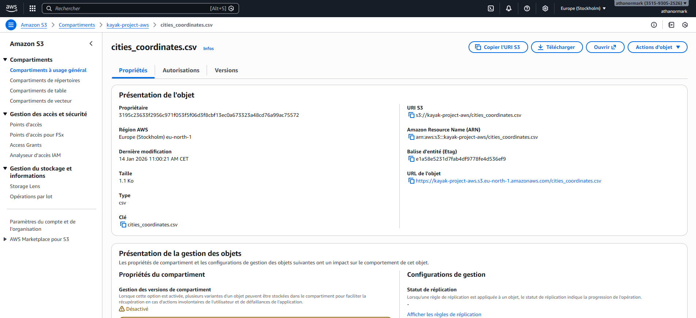
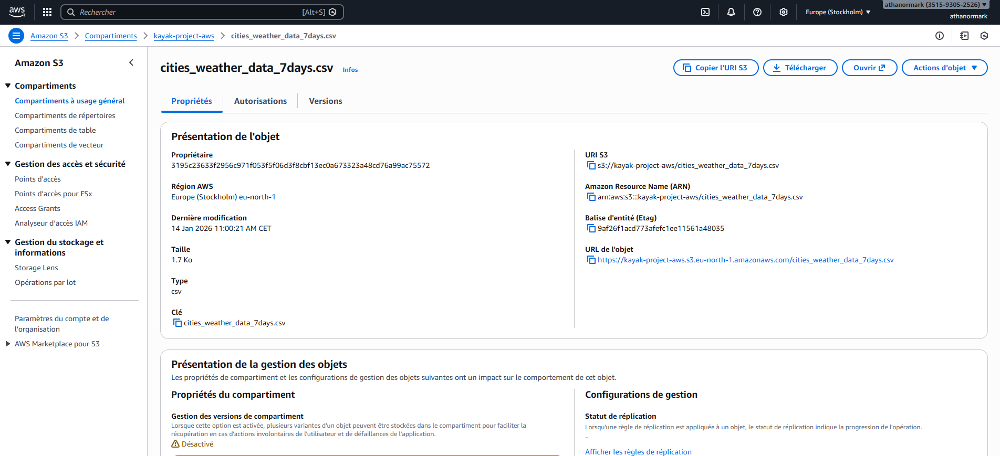
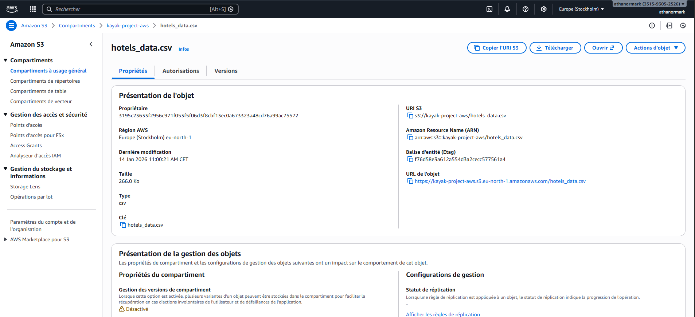

# Projet Kayak - Recommandation de destinations de voyage

[](#)
[](#)
[](#)
[](#)
[](#)
[](#)

Pipeline Data Engineering End-to-End pour identifier les meilleures destinations en France selon la météo et les hôtels disponibles.

---

## About

Ce projet répond à la question : "Où partir et où dormir pour profiter du meilleur climat cette semaine ?"

Le système collecte des données météo et hôtelières, les stocke dans le Cloud AWS, puis génère des cartes interactives de recommandation. Le pipeline complet s'exécute via 6 notebooks séquentiels ou via le script `main.py`.

---

## Dataset

Les données proviennent de trois sources :

- **Nominatim (OpenStreetMap)** : coordonnées GPS des 35 villes cibles
- **OpenWeatherMap One Call 3.0** : prévisions météo à 7 jours (température, pluie)
- **Booking.com (scraping Selenium)** : top 20 hôtels par ville (nom, note, description, lien)

Les CSV générés sont envoyés vers AWS S3 (Data Lake) puis chargés dans PostgreSQL via AWS RDS (Data Warehouse).

---

## Installation

```bash
git clone https://github.com/athanormark/KAYAK-_-BLOC-1_JEDHA_FORMATION.git
cd KAYAK-_-BLOC-1_JEDHA_FORMATION
pip install -r requirements.txt
```

Copiez `.env.example` vers `.env` et renseignez vos clés :

```bash
cp .env.example .env
```

---

## Pipeline

| Notebook | Description |
|---|---|
| `01_Cities_list.ipynb` | Géolocalisation GPS des 35 villes via API Nominatim |
| `02_Meteo_call.ipynb` | Prévisions météo 7 jours via OpenWeatherMap |
| `03_Booking_Scraping.ipynb` | Scraping des hôtels sur Booking.com (Selenium headless) |
| `04_Upload_S3.ipynb` | Upload des CSV vers le Data Lake AWS S3 |
| `05_SQL_RDS.ipynb` | ETL complet : S3 vers PostgreSQL RDS |
| `06_Plotly_Viz.ipynb` | Cartes interactives (Top 5 destinations + Top 20 hôtels) |

Exécution automatisée du pipeline complet :

```bash
python main.py
```

Architecture : API/Scraping -> Python (Pandas) -> CSV -> AWS S3 (Data Lake) -> ETL -> AWS RDS (Data Warehouse) -> Plotly

---

## Résultats

Les cartes ci-dessous sont générées à partir des données du 07/03/2026. Les résultats varient selon la date d'exécution car les prévisions météo sont en temps réel.

**Carte 1 : Top 5 Destinations (score météo)**

Classement par score composite : `temperature_moyenne - (pluie_totale x 0.15)`


**Carte 2 : Top 20 Hôtels**

Meilleurs établissements (par note Booking) situés dans les 5 zones recommandées.


---

## Deploiement AWS

Les donnees sont hebergees dans le Cloud AWS (region eu-west-3 Paris).

**Console AWS S3 - Data Lake**


**Contenu du bucket (fichiers CSV)**


**Apercu des fichiers uploades**

| Fichier | Capture |
|---|---|
| `cities_coordinates.csv` |  |
| `cities_weather_data_7days.csv` |  |
| `hotels_data.csv` |  |

---

## Conclusion

Le pipeline repond a la problematique initiale : **identifier les meilleures destinations en France selon la meteo et les hotels disponibles**.

- Le score composite `temperature_moyenne - (pluie_totale x 0.15)` classe objectivement les destinations par attractivite climatique.
- Le scraping Booking fournit les 20 meilleurs hotels par ville, avec note et lien de reservation.
- L'infrastructure Cloud AWS (S3 + RDS) assure la persistance et la reproductibilite : le pipeline peut etre relance a tout moment pour des resultats actualises.
- Les cartes Plotly permettent une visualisation immediate des recommandations.

**Limites** : le score meteo est simple (lineaire), les prix hotels ne sont pas pris en compte, et le scraping est dependant de la structure HTML de Booking.

---

## Structure du projet

```text
.
├── 01_Cities_list.ipynb        # Géolocalisation
├── 02_Meteo_call.ipynb         # API Météo
├── 03_Booking_Scraping.ipynb   # Scraping Booking
├── 04_Upload_S3.ipynb          # Upload S3
├── 05_SQL_RDS.ipynb            # ETL vers RDS
├── 06_Plotly_Viz.ipynb         # Visualisation
├── main.py                     # Orchestrateur du pipeline
├── requirements.txt            # Dépendances Python
├── .env.example                # Template des variables d'environnement
├── .gitignore
├── maps/                       # Screenshots des cartes Plotly
├── screenshots/                # Captures AWS (S3, RDS)
└── README.md
```

---

## Auteur

Athanor SAVOUILLAN · [GitHub](https://github.com/athanormark)
